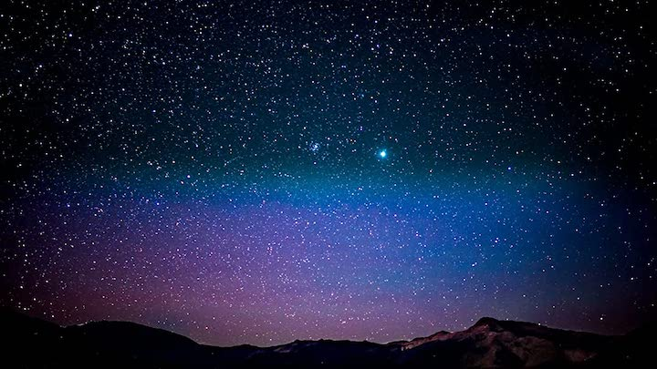

# Digital Humanities 101

This repository contains my group and individual projects for the Summer 2020 class Digital Humanities 101 - Practicing the Digital Humanities. 

## Abstract of Group Project

This paper analyzes three articles in order to expose the inherent bias in the digital humanities. The majority of digital humanists are white men, creating skewed information. Minority groups and women have yet to establish themselves in the field, silencing their unique and untold stories, depriving the public of the true depth and spectrum of the humanities. The articles by Moya Z. Bailey, Lisa Marie Rhody, and Kim Gallon discuss how in the past, minority lenses have not been valued in the digital humanities, but it is now necessary to work towards creating a more inclusive and diverse field. More specifically, these authors call on those currently in the digital humanities for increased accessibility to the field in order to include groups which were formerly marginalized. By analyzing these writings in a group, we were able to employ the ideals that these authors call for: creating a collaboritve environment for the digital humanities that values varying persectives. We found that to accurately represent the world we live in, we must include and make space for new people to join the digital humanities, allowing for a more well rounded examination of the human condition.

## Abstract of Individual Project

This paper outlines my plans for my individual research project. For this project, I will investigate education and common knowledge in the field of astrophysics. This topic is important because the way that we interact with and understand the universe that we live in contributes to our understanding of the human condition. Studying outer space allows us to think of the world in a larger context, not only in physical size but also in very long time scales. My goal is to help people understand how interconnected we are with our expansive universe. I will specifically look into how accessible astrophysics education is to the public and if interactive education is more effective. I will use the Google Books API to research what kinds of astrophysics education can be found on the internet. I will use an online visualization of the scale of the universe to test the effects of interactive education on my peers. 
